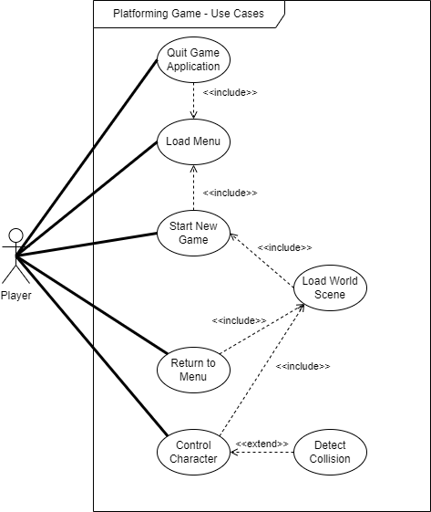
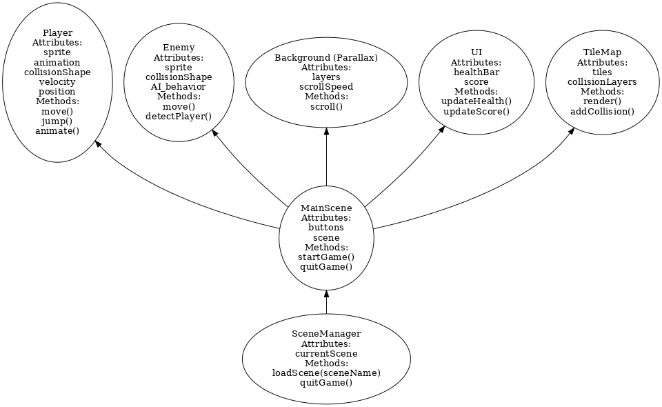

## Group 28

Version 1.0

##### Authors 
Julian Schumacher 
Ben Semenov
Reid McClellan
William White

##### 1. Overview
We will be developing a 2D platforming game where the player has to maneuver through an infinite level, avoiding obstacles. The level will get more challenging and introduce new mechanics and obstacles as the player progresses. 
   
##### 2. Functional Requirements 
1. A new game will start when the player presses the "Play" button on the main menu 
   - **Priority**: High 
   - This is essential for initiating gameplay 

2. The player can exit game by pressing the "Quit" button on the main menu
   - **Priority**: High
   - This is important for providing players with easy way to exit game 

3. The "world" scene gets loaded when the players presses the "Play" button 
   - **Priority**: High
   - This ensures the game starts and players are taken into game world 

4. The system shall allow the player to control a character within the game world 
   - **Priority**: High

5. The system shall detect and respond to collision events in the game world 
   - **Priority**: Medium 

6. The system shall allow player to interact with environment boundaries 
   - **Priority**: Medium 
   - Interactions with environment boundaries contribute to game mechanics 

7. The system shall transition between different scenes (between game levels and menus).
   - **Priority**: Medium 

8. The system should allow the player to return to main menu from game world
   - **Priority**: Low
   - This is less critical during gameplay, but would improve the user's experience 
##### 3. Non-functional Requirements 
1. The game needs to run efficiently on desktop platforms
   - **Priority**: High

2. The game should run at a stable frame rate of at least 60 FPS
   - **Priority**: High
   - A smooth gameplay experience is expected

3. The game should load scenes with very little delay
   - **Priority**: Medium
   - Quick loading times are necessary to prevent interruptions 

4. The game should use minimal CPU and GPU resources 
   - **Priority**: Medium
   - Efficient use of system resources ensures good performance 

5. The game needs to be compatible across desktop operating systems 
   - **Priority**: High
   - This ensures wider distribution 

6. The game will have a simple and intuitive user interface with responsive controls 
   - **Priority**: High 
   - This is necessary for the game to feel fluid and easy to interact with 

##### 4. Use Case Diagram 

##### 5. Class Diagram

